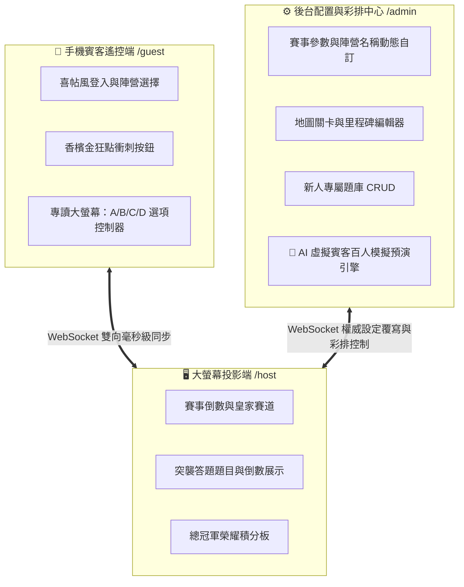
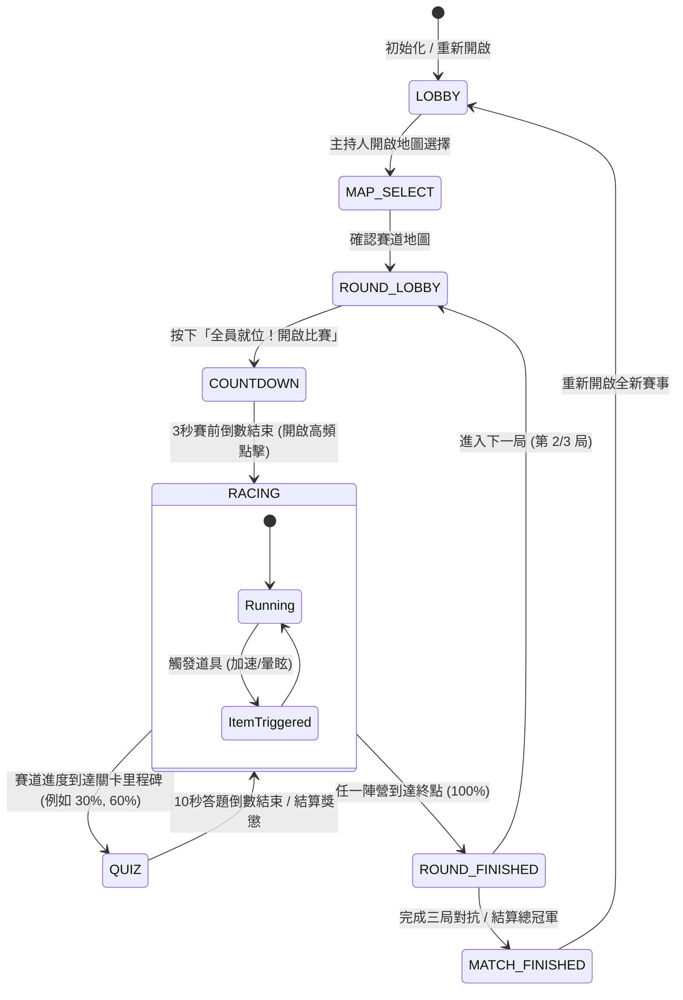

# 🛡️ Lucky Horse — 婚禮互動賽馬與默契大考驗：完整遊戲企劃與系統架構白皮書 (GAME_DESIGN.md)

> **本文件為 Lucky Horse 婚禮遊戲的最高設計憲章與架構總覽**。
> 本專案為千人現場婚禮設計，致力於打破傳統派對遊戲「安裝繁瑣、畫質粗俗、網路易斷、無法彩排」的痛點。
> 未來所有接手本專案的 AI 模型（無論參數規模大小）與開發人員，在進行任何新功能開發、UI 設計或系統維護時，**必須嚴格遵守本文件的架構設計、美學規範與資料結構**。

---

## 🌟 1. 遊戲核心概念與特色 (Executive Summary)

**Lucky Horse** 是一款專為頂級婚禮盛宴量身訂製的**「多螢幕即時對抗派對遊戲」**。
在婚禮現場，新郎與新娘分別代表**「🔴 新郎應援陣營 (Groom Team)」**與**「🔵 新娘應援陣營 (Bride Team)」**。全場數百位賓客無需下載安裝任何 App，只需用手機相機掃描現場大螢幕投影的 QR Code，即可秒速加入對抗賽！



### 🎯 六大獨創創新機制
1. **🚀 零安裝與斷線自癒 (Zero-Install & Self-Healing)**：純 HTML5 + Vanilla JS 打造，行動優先設計，0.5 秒瞬間載入。具備自動補註冊與斷線重連快照還原機制。
2. **🏆 權威三局制賽制 (Three-Round Match)**：固定三局對抗，局間休息開放重新選擇陣營與新賓客入席，累計幸福積分決定總冠軍。
3. **📺 答題分屏共讀互動 (Split-Screen Quiz Focus)**：當賽道到達里程碑觸發突襲關卡時，**「題目與倒數計時僅顯示在大螢幕」**，而賓客手機端**「僅顯示 A / B / C / D 四個專屬配色按鈕」**，創造全場抬頭注視大螢幕、共同為新人祝福的沉浸氛圍！
4. **⚖️ 動態人數平衡公式 (Dynamic Fairness Engine)**：為避免新郎與新娘親友桌數不等導致不公，系統後端自動採用平衡公式：`實際進度貢獻 = 基礎加速力 / sqrt(該隊當前總人數)`，人少隊伍單次點擊貢獻更高，保證絕對公平！
5. **💎 皇家宴會級奢華美學 (Luxury Wedding Aesthetics)**：嚴格對照「婚禮主色調（藏青、白紗、奶茶、湖水綠）」與「賓客穿搭建議（酒紅、灰藍、霧玫粉、薰衣草紫）」，徹底告別電競霓虹感。
6. **🤖 全功能後台與模擬彩排控制台 (Admin & Simulation Rehearsal Center)**：內建 AI 虛擬賓客模擬器，主持人無需準備百支手機，在單台電腦即可一鍵產生 20~100 名虛擬機器人自動加入、點擊與作答，隨時進行全流程彩排與大螢幕壓力測試！

---

## 🎨 2. 頂級婚禮奢華美學與設計語彙 (Design System & Tokens)

為確保專案質感達到 **「$100,000 頂級婚禮宴會」** 的標準，所有 CSS 檔案（`host.css`, `guest.css`, `admin.css`）必須統一採用以下 Design Tokens：

### 2.1 核心配色表 (Color Palette Mapping)
```css
:root {
  /* --- 婚禮主色調 Wedding Core Palette --- */
  --navy-dark: #132238;          /* 深藍色/藏青色 - 沉穩、優雅、經典 (主背景與深色基底) */
  --navy-card: rgba(26, 43, 76, 0.82); /* 藏青玻璃磨砂卡片 (Glassmorphism) */
  --wedding-white: #FAF9F5;      /* 白紗 - 純淨、浪漫、永恆 (主字體與明亮區塊) */
  --milktea: #D8C3A5;            /* 奶茶色 - 溫柔、柔和、質感 (高亮標題、金邊、 CTA 按鈕) */
  --milktea-light: #EAE0CE;      /* 奶茶高光版 */
  --lake-green: #7AB8B1;         /* 湖水綠 - 廳內桌巾 (點綴、特效、進度條、計時器) */

  /* --- 陣營對抗與賓客穿搭色系 (Factions & Options) --- */
  /* 🔴 新郎應援陣營 Groom Team */
  --team-red-main: #88303C;      /* 酒紅色 Burgundy - 成熟、優雅、喜慶 */
  --team-red-light: #C98CA7;     /* 霧玫粉 Dusty Rose - 浪漫、柔和 */
  
  /* 🔵 新娘應援陣營 Bride Team */
  --team-blue-main: #4A6B8A;     /* 灰藍色 Slate Blue - 清新、知性、高貴 */
  --team-blue-light: #9B8AA4;    /* 薰衣草紫 Lavender - 優雅、氣質 */

  /* ❓ 突襲答題選項配色 (A / B / C / D) */
  --dusty-rose: #C98CA7;         /* 選項 A 專屬邊框與高亮 */
  --lavender: #9B8AA4;           /* 選項 B 專屬邊框與高亮 */
  --sage-green: #8FAD91;         /* 選項 C 專屬邊框與高亮 */
  --champagne: #DFD1BA;          /* 選項 D 專屬邊框與高亮 */
  --terracotta: #B86B53;         /* 磚橘色 - 暈眩/停滯/倒數警告 */
}
```

### 2.2 皇家排版與字體規範 (Typography)
* **英文與數字標題**：採用 **`Cinzel`**（羅馬精品碑文體）與 **`Cormorant Garamond`**（優雅法式宋體），讓局數、倒數秒數與戰報呈現頂級名錶般的精緻感。
* **中文標題與內文**：採用 **`Noto Serif TC`**（思源宋體）作為各級標題與儀式稱謂，搭配現代清晰的 **`Outfit`** / **`Noto Sans TC`** 處理動態數值與按鈕說明。

---

## 🏗️ 3. 系統狀態機與架構設計 (State Machine & Architecture)

遊戲核心由 Node.js 後端 `GameManager` 作為權威狀態機（Authoritative State Machine），驅動大螢幕、手機端與後台的同步：



---

## ⚙️ 4. 全功能後台配置與模擬彩排控制台 (/admin)

為落實「判斷力制度化與高可拓展性」，我們設計了獨立的後台管理中心 `http://localhost:3000/admin`。
後台具備四大核心模組與 **AI 虛擬賓客模擬引擎**：

### 4.1 賽事與陣營動態配置 (Team & Racing Config)
* **動態陣營名稱**：支援隨時修改紅/藍兩隊顯示名稱（如：「新郎親友應援團 vs 新娘閨蜜應援團」），送出後 WebSocket 在 50ms 內實時更新全場畫面。
* **勝利里程與門檻**：可調整 `trackLength`（預設 1000px，對應約 500~1500 次有效點擊，可依現場賓客多寡彈性伸縮）。
* **物理與競速參數**：調整基礎加速係數 `baseBoost`、摩擦阻力 `friction`、最高限速 `maxSpeed` 與點擊防刷冷卻 `tapCooldown`（預設 50ms，上限 20次/秒）。

### 4.2 賽道地圖與關卡規則設計 (Map & Checkpoints Designer)
* **地圖 CRUD**：新增、修改或刪除賽道地圖（如：「🌸 浪漫櫻花大道」、「✨ 星空婚禮禮堂」）。
* **里程碑關卡觸發器**：設定該地圖在達到幾百分比時（如：30%、60%、85%）自動觸發指定的互動問題。

### 4.3 互動題庫與突襲關卡編輯器 (Quiz & Question Bank)
* **新人專屬題庫 CRUD**：後台直接編輯題目與選項（例如：「新郎新娘第一次一起出國是去哪裡？」 A.日本 B.法國 C.冰島 D.瑞士）。
* **獎懲配置**：設定答題倒數時間（預設 10 秒）、答對率 > 70% 的衝刺獎勵（`LARGE_BOOST: +150px`）與答錯懲罰（`STUN: 暈眩停滯 3000ms`）。

### 4.4 🤖 AI 虛擬賓客百人彩排預演引擎 (Bot Simulation Rehearsal Center) 【專利級創新】
在婚禮彩排時，主持人與新人往往苦於「找不到 100 個人一起測試大螢幕與網路穩定度」。
本系統在後端建立 **In-Memory Bot Simulation Engine**：
* **🤖 一鍵產生虛擬賓客**：可選擇產生 **20 人 / 50 人 / 100 人** 虛擬機器人。系統會在記憶體內自動為其分配「熱情賓客_1~100」的稱呼與頭像，並自動平衡加入紅藍兩隊。
* **🚀 自動瘋狂點擊模擬**：當進入 `RACING` 狀態時，虛擬機器人會以每秒 5~15 次的隨機頻率自動發送 `GUEST_TAP` 封包，驅動大螢幕馬匹極速前進！
* **📝 自動突襲關卡作答**：當觸發 `QUIZ` 關卡時，虛擬機器人會在 1~6 秒內隨機選擇 A/B/C/D 作答，完美模擬現場百人同時作答的分流回饋與正確率結算！
* **⚡ 上帝模式現場控台 (Live GM Tools)**：遊戲中途可隨時「一鍵強制觸發突襲答題」、「一鍵釋放暴風雨減速 / 幸運金幣道具」、「一鍵跳轉局數與重置遊戲」。

---

## 📡 5. WebSocket 通訊協定與事件清單 (Event Catalog)

任何未來接手的 AI 模型或工程師在增加或修改功能時，**必須先於 `shared/events.js` 定義事件名稱**，並於本章節歸檔：

### 5.1 客戶端發往伺服器 (CLIENT_TO_SERVER)
| 事件名稱 (Constant) | 傳送來源 | 封包內容 (Payload Structure) | 說明與後端邏輯 |
| :--- | :--- | :--- | :--- |
| `GUEST_JOIN` | 📱 手機端 | `{ nickname: string, avatar: string }` | 賓客設定稱呼與頭像入席 |
| `GUEST_CHOOSE_TEAM` | 📱 手機端 | `{ teamId: 'red' \| 'blue' }` | 選擇應援陣營（具備自動補註冊容錯） |
| `GUEST_TAP` | 📱 手機端 | `{ timestamp: number }` | 瘋狂點擊應援（經過 50ms 冷卻防抖驗證） |
| `GUEST_QUIZ_ANSWER` | 📱 手機端 | `{ quizId: string, answer: 'A'\|'B'\|'C'\|'D' }` | 關卡作答（送出後立即鎖定） |
| `HOST_SELECT_MAP` | 🖥️ 大螢幕 | `{ mapId: string }` | 主持人選擇賽道地圖 |
| `HOST_START_ROUND` | 🖥️ 大螢幕 | `{}` | 全員就位，開始本局 3 秒倒數與比賽 |
| `HOST_NEXT_ROUND` | 🖥️ 大螢幕 | `{}` | 結算完畢，進入下一局大廳 |
| `ADMIN_UPDATE_CONFIG` | ⚙️ 後台 | `{ trackLength, teamNames, ... }` | 更新遊戲與陣營參數 |
| `ADMIN_SAVE_MAP` | ⚙️ 後台 | `{ mapId, name, trackLength, checkpoints }` | 儲存/修改地圖規則 |
| `ADMIN_SAVE_QUIZ` | ⚙️ 後台 | `{ quizId, question, options, answer, ... }` | 儲存/修改題庫內容 |
| `ADMIN_SPAWN_BOTS` | ⚙️ 後台 | `{ count: number }` | 啟動 AI 虛擬賓客百人模擬彩排 |
| `ADMIN_CLEAR_BOTS` | ⚙️ 後台 | `{}` | 清除所有虛擬機器人 |
| `ADMIN_FORCE_TRIGGER`| ⚙️ 後台 | `{ type: 'QUIZ'\|'ITEM', targetId?: string }` | 上帝模式強制觸發關卡或道具 |

### 5.2 伺服器發往客戶端 (SERVER_TO_CLIENT)
| 事件名稱 (Constant) | 接收對象 | 封包內容 (Payload Structure) | 說明與前端渲染規範 |
| :--- | :--- | :--- | :--- |
| `GAME_STATE_SYNC` | 全體 | `{ state, roundStatus, currentMap, teams, activeItems, config }` | 全量狀態校正廣播 |
| `GAME_POSITION_UPDATE`| 🖥️ 大螢幕 | `{ teams: { red: {position, speed}, blue: {...} } }` | 30fps 高頻位置與速度廣播 |
| `GAME_QUIZ_START` | 🖥️ 大螢幕 | `{ quizId, question, timeLimit }` | **僅發給 Host**：顯示題目與計時器 |
| `GAME_QUIZ_OPTIONS` | 📱 手機端 | `{ quizId, options: ['A','B','C','D'], timeLimit }` | **僅發給 Guest**：顯示四選項與計時器 |
| `GAME_QUIZ_RESULT` | 全體 | `{ correctAns, teamResults: { red: {rate, effect}, ... } }` | 揭曉正確答案與雙方答對率獎懲 |
| `GAME_JOIN_LOCKED` | 📱 手機端 | `{ reason: 'RACE_IN_PROGRESS' }` | 提示比賽進行中，暫時鎖定加入 |
| `SYSTEM_ERROR` | 📱 / ⚙️ | `{ code, message }` | 零靜默失敗！回報明確錯誤訊息 |

---

## 🛡️ 6. 永續開發與防禦性工程制度 (Defensive Engineering)

本專案已固化下述五大防禦準則至 `.agents/AGENTS.md` 與 `docs/REALTIME_DEFENSIVE_GUIDE.md`：
1. **雙向狀態檢查**：前端收到任何 `GAME_STATE_SYNC` 時，務必先檢驗本地會話生命週期 (`myPlayerInfo.isJoined`)，未加入前嚴禁盲目跳轉選隊或賽場頁面。
2. **零靜默失敗承諾**：後端處理任何 `chooseTeam`, `handleTap`, `handleAnswer` 時，若邏輯判定失敗，**100% 必須發送對應錯誤封包 (`GAME_JOIN_LOCKED` 或 `SYSTEM_ERROR`)** 回前端，杜絕「按了沒反應」。
3. **自動容錯與補註冊 (Self-Healing)**：若斷線賓客或新連線未發送 `GUEST_JOIN` 就直接點擊選隊或互動，後端 `TeamManager` 自動調用 `addPlayer` 為其補齊預設身份，平滑納入遊戲。
4. **50ms 樂觀觸發回饋**：手機端點擊押注或狂點應援時，前端在 **50ms 內**即時給予按鈕變色、振動與 +1 浮動字樣回饋，消除網路 RTT 焦慮。
5. **優雅關閉防衝突 (Graceful Shutdown)**：伺服器監聽 `SIGINT` 與 `SIGTERM`，重啟前自動停止廣播迴圈並呼叫 `server.close()` 釋放 `3000` 連接埠，徹底杜絕 `EADDRINUSE` 當機。

---

## 🏁 7. 快速啟動與驗證流程

### 7.1 啟動遊戲與後台伺服器
```bash
npm run dev
```
啟動後系統同時開啟四大端口：
* 🖥️ **大螢幕投影端**：`http://localhost:3000/host`
* 📱 **手機賓客端**：`http://localhost:3000/guest`
* ⚙️ **後台配置與彩排中心**：`http://localhost:3000/admin`

### 7.2 一鍵模擬彩排 SOP
1. 打開電腦瀏覽器前往 `http://localhost:3000/admin`。
2. 在「🤖 模擬預演與現場控台」分頁，點擊 **「產生 100 名虛擬賓客」**。
3. 切換至大螢幕端 `http://localhost:3000/host`，驗證大廳是否瞬間湧入 100 人並平衡分隊。
4. 點擊「🚀 全員就位！開啟比賽」，驗證 100 名虛擬機器人自動狂點衝刺與突襲關卡自動作答的震撼大螢幕視覺！
