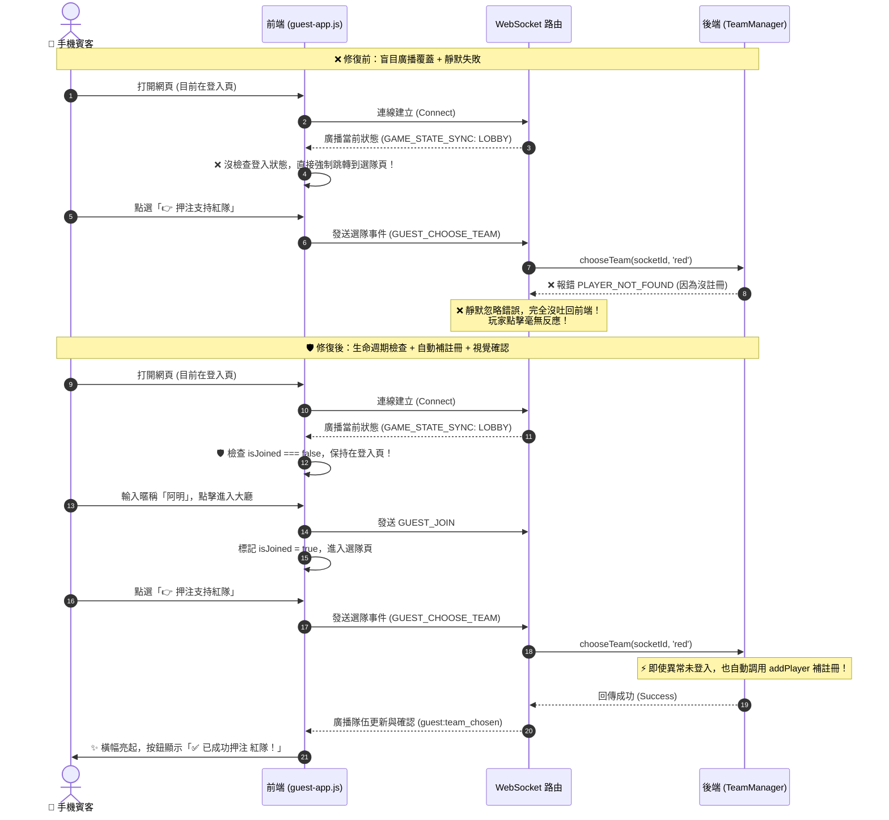

# 🛡️ Lucky Horse v1.1 — 即時互動防禦性工程與制度指南 (Engineering Guide)

本指南旨在把本次 **Lucky Horse v1.1 婚禮互動賽馬遊戲** 開發過程中積累的架構判斷與錯誤排除經驗，轉換為**可長期沿用的制度與標準規範**。
透過這套制度與指南，未來無論是資淺工程師、或是執行日常維護的 AI 模型，都能清楚理解系統核心機制，避免再次發生「點擊沒反應 (Silent Failure)」、「狀態不同步 (State Desync)」與「埠號衝突 (`EADDRINUSE`)」等典型高並發互動系統 Bug。

---

## 🏗️ 1. 問題根源分析與防禦性修復架構

在實時多人互動 (Real-time Multi-player Interactive) 系統中，最易出現的漏洞就是 **「樂觀假設客戶端狀態與伺服器完全同步」**。
以下是我們在選隊押注無反應 Bug 中發現的根源，以及我們建立的三重防禦架構：

### 1.1 狀態不同步與靜默失敗時序圖 (修復對照)



---

## 📊 2. 防禦性工程制度標準對照表

為確保長期維護穩定性，系統中所有通訊與狀態操作必須嚴格落實下表準則：

| 檢查面向 | 潛在致命陷阱 (Pitfalls) | 標準防禦性做法 (Institutional Rule) | 實作檔案與位置 |
| :--- | :--- | :--- | :--- |
| **前端狀態路由** | 盲目跟隨伺服器廣播跳轉畫面，導致用戶正在輸入表單或尚未登入時被強制拉走。 | **本地會話權威驗證**：收到狀態廣播時，必須先檢驗 `myPlayerInfo.isJoined`，未加入前一律鎖定在登入頁。 | `guest/js/guest-app.js`<br>*(GAME_STATE_SYNC)* |
| **後端異常處理** | 處理業務邏輯失敗時（如找不到玩家、隊伍無效），只 return `false`，未透過 Socket 回報，造成靜默失敗。 | **零靜默失敗承諾**：失敗必發封包！依性質分流為業務阻擋 (`GAME_JOIN_LOCKED`) 或系統錯誤 (`SYSTEM_ERROR`)。 | `server/websocket/GuestHandler.js`<br>*(handleChooseTeam)* |
| **高並發容錯** | 婚禮網路不穩，手機鎖屏重連或跳步驟發送封包時，後端拋錯拒絕，導致玩家卡死。 | **自動補註冊機制 (Self-Healing)**：若用戶漏了 Join 直接選隊或互動，後端自動分配預設稱呼納入遊戲，保證流程順暢。 | `server/game/TeamManager.js`<br>*(chooseTeam)* |
| **用戶互動回饋** | 手機端點擊按鈕後，要等後端處理完再變化 UI，網路稍慢就會覺得「卡卡的、按了沒反應」。 | **樂觀 UI 回饋與明確狀態**：觸控點擊 50ms 內即時給予振動/特效，且按鈕文字清楚展示狀態 (`✅ 已押注`)。 | `guest/js/guest-app.js`<br>*(team_chosen)* |
| **伺服器進程管理** | 修改程式碼重啟時，常因舊進程未釋放連接埠而當機 (`EADDRINUSE :::3000`)。 | **優雅關閉 (Graceful Shutdown)**：監聽 `SIGINT`/`SIGTERM`，重啟前主動切斷 WebSocket 迴圈並釋放 TCP 埠號。 | `server/index.js`<br>*(process.on)* |

---

## 🛠️ 3. 日常開發與測試的標準作業流程 (SOP)

為了讓未來開發者與小型 AI 模型都能順利協作，請在專案中遵循以下標準測試與部署流程：

### 3.1 啟動開發環境伺服器 (保持常駐)
請在終端機開啟**第一個獨立視窗**執行以下指令。此視窗為伺服器核心，**在進行測試或改寫程式碼時，請保持該視窗開啟**：
```bash
npm run dev
```
> **優雅重啟**：當我們修改了後端程式碼需要重啟時，請在這個視窗按下 `Ctrl + C`，系統將觸發我們新設的「優雅關閉機制」釋放 `3000` 埠，隨後即可再次執行 `npm run dev`，杜絕 `EADDRINUSE` 錯誤。

### 3.2 執行百人高並發壓力測試 (模擬實戰)
在伺服器運作時，請開啟**第二個獨立終端機視窗**執行壓力測試腳本：
```bash
npm test
```
**測試通過指標 (成功判斷標準)**：
1. 終端機顯示 `✅ [成功] 所有 120 個連線已建立！`
2. 顯示 `✅ [成功] 全部 120 名賓客已完成登入並加入紅/藍兩隊！`
3. 伺服器沒有產生任何一筆 `UnhandledPromiseRejection` 或記憶體溢位 (`Out of Memory`)。
4. 當在大螢幕端按下「開始對抗賽」後，伺服器能以 30fps 順暢廣播百人的高頻點擊加速與突襲答題！

---

## 📝 4. 結語：制度化讓系統越用越強

透過把「狀態檢查、靜默失敗防護、自動容錯、優雅釋放」固化入 `.agents/AGENTS.md` 與本工程指南，我們不僅解決了這次的 Bug，更為 Lucky Horse 專案建立了一道永久的防火牆。未來任何 AI 模型接手時，都會優先讀取這些規範，讓程式碼品質維持在最高水準！
